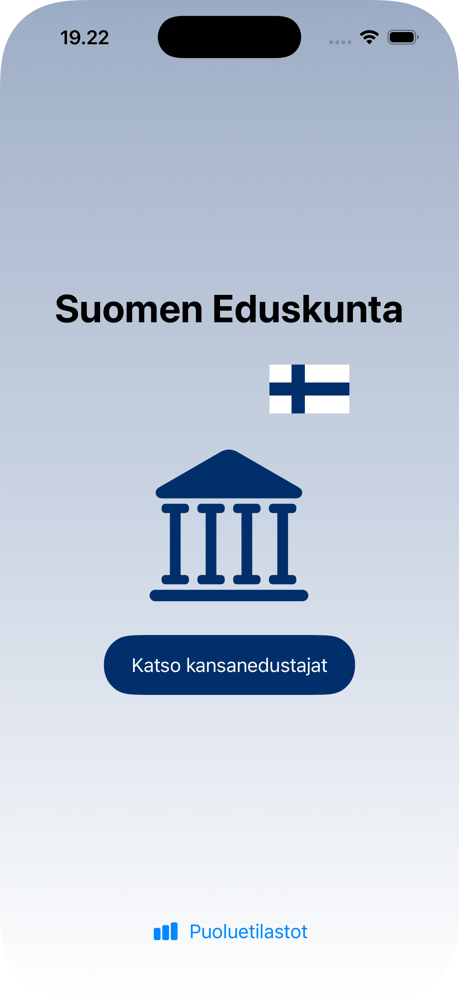
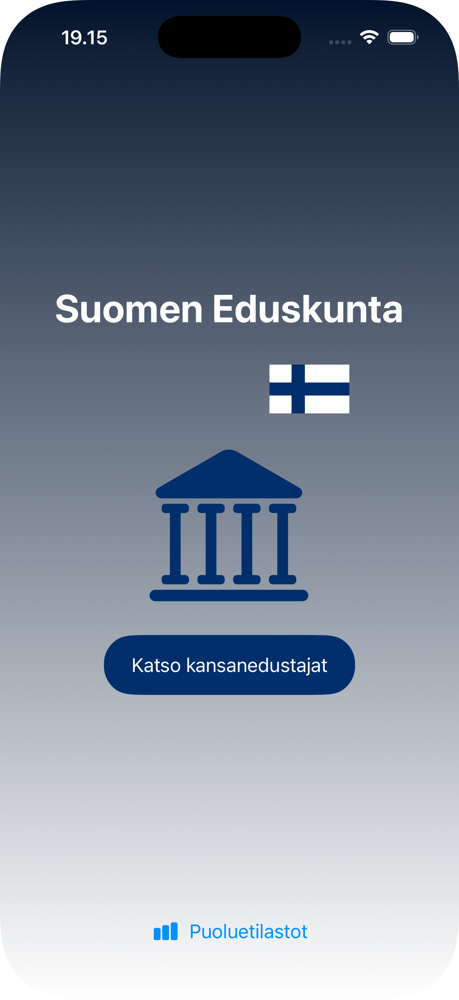

# Eduskunta iOS App

Eduskunta App is a simple iOS application that demonstrates using NavigationStack, URLSession, and SwiftData in a Swift project. The app shows a list of Finnish Parliament members and allows viewing their details.

## Features

- Two-level browsing: Party → Members list — Users can browse members by party, then drill down into a filtered members list per party

- Sorting & Filtering (MemberListView)

    - Sort by first name, last name or highest rating
    - Filter by constituency via toolbar menu
    - Active filter indicated by filled filter icon
      
- Search (MemberListView)
      - Search bar filters members by first or last name

- Member detail screen with photo, seat number, party, constituency, minister status, and Twitter handle — Each member has a dedicated detail screen fetching their photo from a remote URL

- Notes per member with 👍 / 👎 indicator and text — Users can add, edit, and delete personal notes for each member with a positive or negative rating

- Note editing and deletion (MemberDetailView)
      
  - Pencil icon loads the existing note into the text field for editing
  - Trash icon deletes the note permanently
  - Save button changes to "Update" when in edit mode
  - The note being edited is highlighted with a blue background

- Offline support with SwiftData — Member data and notes are persisted locally using SwiftData, no internet connection required after initial load

- PartyStatistics (PartyStatsView)

  - Displays likes and dislikes per party from all member notes
  - Parties are ranked by net score (likes minus dislikes)
  - Each row shows a green/red progress bar
  - Net score is displayed as green + or red – number

- Simple and responsive UI — Clean SwiftUI interface with dark and light mode support

## Tech Stack 

 - iOS 

 - NavigationStack

 - URLSession (API calls) 

 - SwiftData (Local database) 

 - @State / @Query (State management)

## Screenshots

 

## Video Link

[YT Video Link](https://www.youtube.com/watch?v=pXCZ4lLA-IM)
